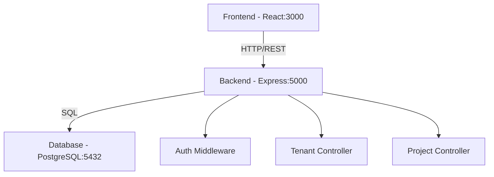

# How to Create and Upload Diagram Images

You need to create 2 PNG diagram images and upload them to this folder.

## Required Files:
1. `system-architecture.png`
2. `database-erd.png`

---

## 📊 DIAGRAM 1: system-architecture.png

### What to Show:
A visual representation of your 3-tier architecture:

```
┌─────────────────────────────────────┐
│      Frontend (React)               │
│      Port: 3000                     │
│  - Login/Register                   │
│  - Dashboard                        │
│  - Projects & Tasks                 │
└──────────────┬──────────────────────┘
               │ HTTP/REST API
               ▼
┌─────────────────────────────────────┐
│    Backend (Node.js + Express)      │
│      Port: 5000                     │
│  - Auth Controller                  │
│  - Tenant Controller                │
│  - Project Controller               │
│  - Middleware (Auth, RBAC)          │
└──────────────┬──────────────────────┘
               │ SQL Queries
               ▼
┌─────────────────────────────────────┐
│    Database (PostgreSQL)            │
│      Port: 5432                     │
│  - tenants, users                   │
│  - projects, tasks                  │
│  - audit_logs                       │
└─────────────────────────────────────┘
```

### How to Create:
**Option 1 - Draw.io (Recommended):**
1. Go to https://app.diagrams.net/
2. Click "Create New Diagram"
3. Add 3 boxes (one for each layer)
4. Add arrows showing connections
5. Export as PNG: File → Export as → PNG
6. Save as `system-architecture.png`

**Option 2 - Mermaid Live:**
1. Go to https://mermaid.live/
2. Use this code:

3. Click "Export PNG"
4. Save as `system-architecture.png`

---

## 🗄️ DIAGRAM 2: database-erd.png

### Tables to Include:

**tenants**
- id (PK)
- name
- subdomain
- status

**users**
- id (PK)
- tenant_id (FK → tenants)
- email
- role

**projects**
- id (PK)
- tenant_id (FK → tenants)
- name
- status

**tasks**
- id (PK)
- project_id (FK → projects)
- tenant_id (FK → tenants)
- title
- assigned_to (FK → users)

**audit_logs**
- id (PK)
- tenant_id (FK → tenants)
- user_id (FK → users)
- action

### Relationships:
- tenants → users (one-to-many)
- tenants → projects (one-to-many)
- projects → tasks (one-to-many)
- users → tasks (assigned_to)

### How to Create:
**Option 1 - dbdiagram.io (Best for ERD):**
1. Go to https://dbdiagram.io/
2. Use this code:
```sql
Table tenants {
  id uuid [pk]
  name varchar
  subdomain varchar
  status varchar
}

Table users {
  id uuid [pk]
  tenant_id uuid [ref: > tenants.id]
  email varchar
  role varchar
}

Table projects {
  id uuid [pk]
  tenant_id uuid [ref: > tenants.id]
  name varchar
  status varchar
}

Table tasks {
  id uuid [pk]
  project_id uuid [ref: > projects.id]
  tenant_id uuid [ref: > tenants.id]
  title varchar
  assigned_to uuid [ref: > users.id]
}

Table audit_logs {
  id uuid [pk]
  tenant_id uuid [ref: > tenants.id]
  user_id uuid [ref: > users.id]
  action varchar
}
```
3. Click "Export" → "Export to PNG"
4. Save as `database-erd.png`

**Option 2 - Draw.io:**
1. Use table shapes to create each table
2. Add lines to show relationships
3. Export as PNG

---

## 📤 How to Upload to GitHub

### Method 1: Upload via Web Interface (Easiest)
1. Go to: https://github.com/PavaniVattikolla/multi-tenant-saas-platform/tree/main/docs/images
2. Click "Add file" → "Upload files"
3. Drag and drop your 2 PNG files
4. Add commit message: "Add architecture and ERD diagrams"
5. Click "Commit changes"

### Method 2: Upload via Git Commands
```bash
cd multi-tenant-saas-platform/docs/images
cp /path/to/system-architecture.png .
cp /path/to/database-erd.png .
git add *.png
git commit -m "Add architecture and ERD diagrams"
git push
```

---

## ✅ Verification

After uploading, verify files exist:
- docs/images/system-architecture.png
- docs/images/database-erd.png

They will be automatically referenced in your architecture.md file!

---

## 🚀 Quick Links
- Draw.io: https://app.diagrams.net/
- Mermaid Live: https://mermaid.live/
- dbdiagram.io: https://dbdiagram.io/
- Excalidraw: https://excalidraw.com/ (Simple & Fast)
